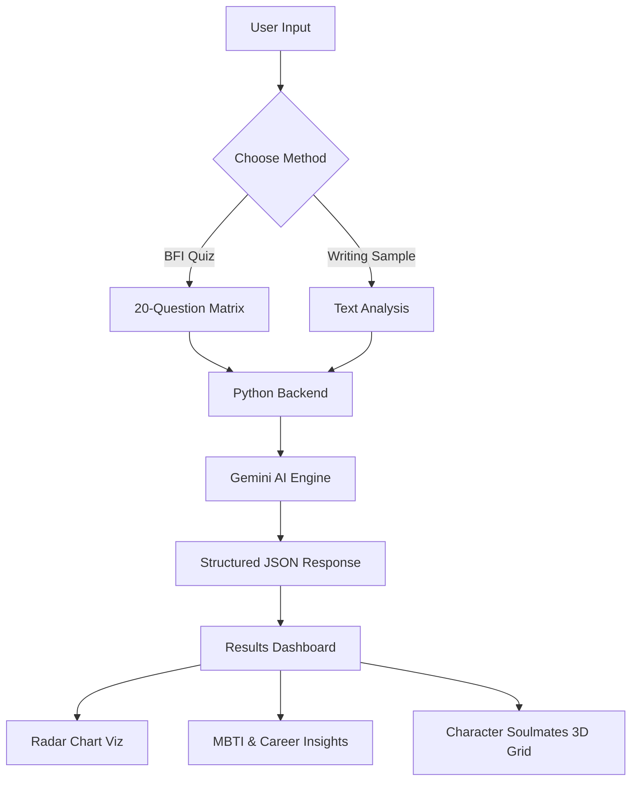

# Project Report: AI-Powered Personality Analysis System

## 1. Project Overview
The **AI-Powered Personality Analysis System** is a high-fidelity psychological assessment application designed to provide users with deep insights into their personality. It utilizes a hybrid methodology, combining the quantitative **Big Five Inventory (BFI)** questionnaire with qualitative **Psycholinguistic Analysis** of user writing samples. By leveraging the **Google Gemini 2.5 Flash** AI model, the system maps these traits to the Myers-Briggs Type Indicator (MBTI) and generates personalized career, relationship, and lifestyle recommendations.

## 2. Module-Wise Breakdown
*   **A. Frontend Interface (The User Layer):**
    *   **Quiz Engine:** A dynamic, state-managed 20-question interface for the Big Five assessment.
    *   **Linguistic Input Module:** A dedicated text analysis section for processing writing samples.
    *   **Results Dashboard:** A responsive visual dashboard featuring glassmorphism design.
*   **B. Backend Server (The Processing Layer):**
    *   **Lightweight Python Server:** A pure Python implementation (`HTTPServer`) for handling API requests and serving static files.
    *   **Security Manager:** Handles API key validation and local-only processing for privacy.
*   **C. AI Orchestration (The Intelligence Layer):**
    *   **Gemini API Integration:** Manages complex prompt engineering to ensure structured JSON output.
    *   **XAI Module:** Generates "Explainable AI" reasoning for each personality trait score.
*   **D. Visualization & Matching (The Insight Layer):**
    *   **Data Viz Module:** Integrated Chart.js for real-time Radar Chart generation.
    *   **Character Engine:** A matching algorithm that pairs MBTI types with famous figures and Anime/Bollywood characters.

## 3. Functionalities
*   **Dynamic BFI Assessment:** Interactive scoring of Openness, Conscientiousness, Extraversion, Agreeableness, and Neuroticism (OCEAN).
*   **AI Writing Analysis:** Deep-dive analysis of writing style to infer psychological traits.
*   **MBTI Mapping:** Heuristic-based conversion of OCEAN scores to MBTI types (e.g., INTJ, ENFP).
*   **Interactive Character Soulmates:** 3D flip-cards showcasing matching characters from popular culture.
*   **Visual Personality Radar:** High-fidelity graphical representation of trait strengths.
*   **Career & Growth Insights:** AI-generated roadmaps for professional and personal development.

## 4. Technology Used
*   **Programming Languages:**
    *   **Python:** Used for the backend logic and AI orchestration.
    *   **JavaScript (ES6+):** Powering the frontend interactivity and data processing.
    *   **HTML5/CSS3:** For the structural layout and premium glassmorphism styling.
*   **Libraries and Tools:**
    *   **Google Gen AI SDK:** For interfacing with Gemini 2.5 Flash.
    *   **Chart.js:** For rendering interactive radar charts.
    *   **Mimetypes & JSON (Python Built-ins):** For server-side file handling.
*   **Other Tools:**
    *   **GitHub:** For version control and collaborative development.
    *   **VS Code:** Primary IDE for development.
    *   **Google AI Studio:** For API management and prompt testing.

## 5. Flow Diagram

## 6. Revision Tracking on GitHub
*   **Repository Name:** personality-analyzer
*   **GitHub Link:** [https://github.com/sathwika-2200/personality-analyzer](https://github.com/sathwika-2200/personality-analyzer)

## 7. Conclusion and Future Scope
### Conclusion
The project successfully demonstrates how Generative AI can be integrated with traditional psychometric frameworks to create a more engaging and insightful user experience. By moving beyond simple "points-based" scoring to "linguistic-based" analysis, the system provides a holistic view of human personality that is both scientifically grounded and highly accessible.

### Future Scope
*   **Multilingual Support:** Expanding the writing analysis to support regional languages.
*   **Historical Tracking:** Implementing a database to track personality evolution over time.
*   **Integration with LinkedIn:** Analyzing public professional profiles for career-specific feedback.
*   **Mobile Application:** Developing a dedicated Flutter or React Native version.

## 8. References
1. **Big Five Model:** Goldberg, L. R. (1990). "An alternative 'description of personality'".
2. **MBTI Manual:** Myers, I. B., & McCaulley, M. H. (1985).
3. **Google Gemini Documentation:** [https://ai.google.dev/docs](https://ai.google.dev/docs)
4. **Chart.js API:** [https://www.chartjs.org/docs/latest/](https://www.chartjs.org/docs/latest/)

---

## Appendix

### A. AI-Generated Project Elaboration
The system utilizes a complex prompt engineering strategy to transform raw user data (quiz answers or text) into a multi-layered psychological profile. The backend validates the Gemini AI output against a strict JSON schema to ensure that the frontend can reliably render 3D elements, charts, and recommendations without failure.

### B. Problem Statement
Traditional personality tests are often tedious, one-dimensional, and fail to provide actionable insights. Users are frequently left with abstract scores but no explanation of *why* they received them or how to use them. There is a need for a modern, AI-integrated system that provides visual clarity, linguistic analysis, and culturally relevant matching (like character soulmates) to make self-discovery engaging.

### C. Solution/Code
The solution is a decoupled client-server architecture. The server acts as a secure proxy for the Gemini API, while the client manages a state-heavy interface that transforms JSON data into a premium visual experience.

> **Note:** The complete source code is available in the GitHub repository linked in Section 6.
