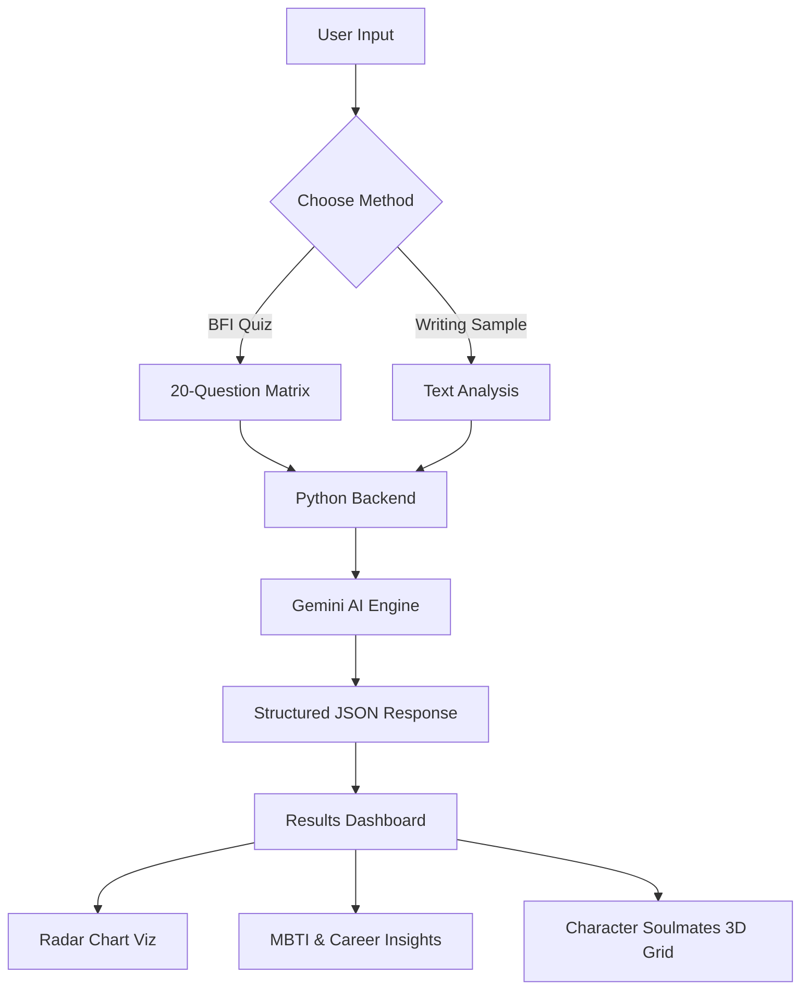

# Project Report: AI-Powered Personality Analysis System

## 1. Project Overview
The **AI-Powered Personality Analysis System** is a high-fidelity psychological assessment application designed to provide users with deep insights into their personality. It utilizes a comprehensive 3-phase methodology, combining quantitative **Personality Questions** with qualitative **Visual Preference Analysis** and **Situation Scenarios**. By leveraging the **Google Gemini 2.5 Flash** AI model, the system analyzes these diverse inputs to generate personalized MBTI mapping, career recommendations, and character soulmate matches.

## 2. Module-Wise Breakdown
*   **A. 3-Phase Assessment Engine:**
    *   **Phase 1: Personality Questions:** Interactive scoring of Big Five traits.
    *   **Phase 2: Visual Preference:** Instinctive image-based choices to gauge subconscious leanings.
    *   **Phase 3: Situation Scenarios:** Real-world response simulation to evaluate cognitive behavior.
*   **B. Results Dashboard:** A responsive visual dashboard featuring glassmorphism design and real-time Chart.js integration.
*   **C. Backend Server:** A pure Python implementation (`HTTPServer`) for handling AI orchestration and secure processing.
*   **D. Intelligence Layer:** Gemini API integration for cross-referencing multi-method data into a cohesive psychological profile.

## 3. Functionalities
*   **Multi-Method Assessment:** Combines traditional questioning with visual and scenario-based tests.
*   **AI-Generated Profile:** Deep-dive analysis of personality indicators across all 3 phases.
*   **MBTI & OCEAN Visualization:** Mapping traits to established frameworks with interactive radar charts.
*   **Interactive Character Soulmates:** 3D flip-cards showcasing matching characters from popular culture.
*   **Explainable AI (XAI):** Provides detailed reasoning for why specific traits were assigned.

## 4. Technology Used
*   **Programming Languages:**
    *   **Python:** Used for the backend logic and AI orchestration.
    *   **JavaScript (ES6+):** Powering the frontend interactivity and data processing.
    *   **HTML5/CSS3:** For the structural layout and premium glassmorphism styling.
*   **Libraries and Tools:**
    *   **Google Gen AI SDK:** For interfacing with Gemini 2.5 Flash.
    *   **Chart.js:** For rendering interactive radar charts.
    *   **Mimetypes & JSON (Python Built-ins):** For server-side file handling.
*   **Other Tools:**
    *   **GitHub:** For version control and collaborative development.
    *   **VS Code:** Primary IDE for development.
    *   **Google AI Studio:** For API management and prompt testing.

## 5. Flow Diagram

## 6. Revision Tracking on GitHub
*   **Repository Name:** personality-analyzer
*   **GitHub Link:** [https://github.com/sathwika-2200/personality-analyzer](https://github.com/sathwika-2200/personality-analyzer)

## 7. Conclusion and Future Scope
### Conclusion
The project successfully demonstrates how Generative AI can be integrated with traditional psychometric frameworks to create a more engaging and insightful user experience. By moving beyond simple "points-based" scoring to "linguistic-based" analysis, the system provides a holistic view of human personality that is both scientifically grounded and highly accessible.

### Future Scope
*   **Multilingual Support:** Expanding the writing analysis to support regional languages.
*   **Historical Tracking:** Implementing a database to track personality evolution over time.
*   **Integration with LinkedIn:** Analyzing public professional profiles for career-specific feedback.
*   **Mobile Application:** Developing a dedicated Flutter or React Native version.

## 8. References
1. **Big Five Model:** Goldberg, L. R. (1990). "An alternative 'description of personality'".
2. **MBTI Manual:** Myers, I. B., & McCaulley, M. H. (1985).
3. **Google Gemini Documentation:** [https://ai.google.dev/docs](https://ai.google.dev/docs)
4. **Chart.js API:** [https://www.chartjs.org/docs/latest/](https://www.chartjs.org/docs/latest/)

---

## Appendix

### A. AI-Generated Project Elaboration
The system utilizes a complex prompt engineering strategy to transform raw user data (quiz answers or text) into a multi-layered psychological profile. The backend validates the Gemini AI output against a strict JSON schema to ensure that the frontend can reliably render 3D elements, charts, and recommendations without failure.

### B. Problem Statement
Traditional personality tests are often tedious and rely solely on self-reporting, which can be biased. There is a need for a multi-method system that combines direct questioning with subconscious visual preferences and real-world scenario simulations to create a more accurate and engaging psychological profile.

### C. Solution/Code
The solution is a multi-phase assessment architecture. By analyzing responses across three distinct domains (Questions, Images, and Scenarios), the Gemini AI can triangulate personality traits with higher confidence, providing a visual and interactive report that is both scientific and culturally relevant.

> **Note:** The complete source code is available in the GitHub repository linked in Section 6.
