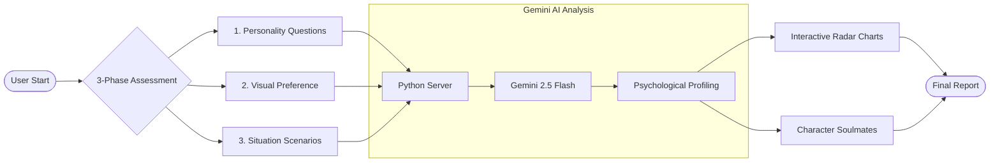
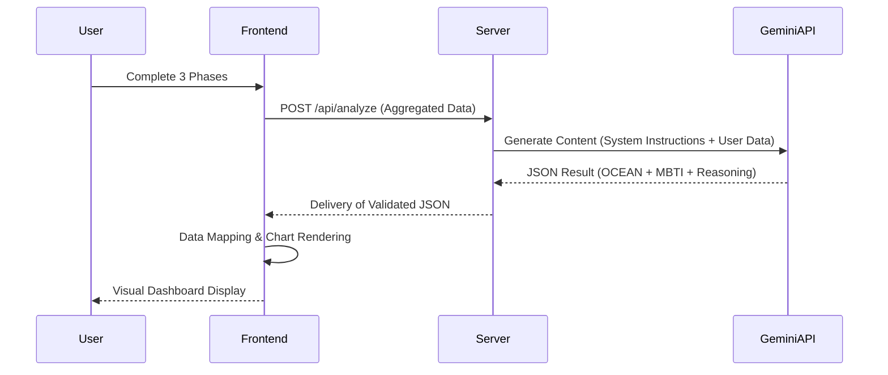

# Detailed Project Report: AI-Powered Multi-Method Personality Analysis System

## 1. Project Introduction & Abstract
The **AI-Powered Personality Analysis System** is an advanced psychometric tool designed to provide a holistic and highly accurate psychological profile of a user. Unlike traditional personality tests that rely on a single data source, this system employs a **Triangulated Assessment Framework**. By capturing data from direct questions, subconscious visual preferences, and simulated behavioral scenarios, the application creates a high-confidence model of the user's personality. 

The core engine is powered by **Google Gemini 2.5 Flash**, which performs real-time psycholinguistic and behavioral analysis to map user inputs into the **Big Five (OCEAN)** model and the **Myers-Briggs Type Indicator (MBTI)**.

---

## 2. Methodology: The Triangulated Assessment Framework
The system operates on three distinct levels to minimize self-reporting bias:

### **Phase 1: Quantitative Personality Questions**
*   **Structure:** A 20-question inventory based on the Big Five Factor model.
*   **Mechanism:** Users rate their agreement with specific statements (e.g., "I pay attention to details").
*   **Goal:** To establish a baseline of the user's self-perception regarding Openness, Conscientiousness, Extraversion, Agreeableness, and Neuroticism.

### **Phase 2: Qualitative Visual Preference (Gut-Reaction)**
*   **Structure:** A series of image-comparison rounds.
*   **Mechanism:** Users are presented with contrasting images (abstract vs. concrete, vibrant vs. muted) and must choose one instinctively.
*   **Goal:** To capture subconscious personality indicators that might be missed in verbal questioning.

### **Phase 3: Cognitive Situation Scenarios**
*   **Structure:** 4-5 high-stakes behavioral scenarios (e.g., handling a workplace conflict or a missed deadline).
*   **Mechanism:** Users select their most likely response from a set of four distinct options.
*   **Goal:** To evaluate decision-making styles, emotional intelligence (EQ), and interpersonal strategies.

---

## 3. Technical Architecture & Module Breakdown

### **A. Frontend Architecture (The Presentation Layer)**
*   **UI/UX Design:** Implemented using a **Glassmorphism Design System**, characterized by frosted-glass effects, vibrant background orbs, and high-fidelity typography (DM Sans).
*   **State Management:** A custom JavaScript state-machine manages the transition between assessment phases, ensuring data persistence until the final API call.
*   **Data Visualization:** Utilizes **Chart.js** to render a dynamic, interactive Radar Chart. The chart features custom tooltips powered by **XAI (Explainable AI)** reasoning.
*   **Interactive Components:** Features 3D CSS-transformed flip-cards for "Character Soulmates," providing a tactile and engaging results experience.

### **B. Backend Architecture (The Processing Layer)**
*   **Core Server:** A lightweight, dependency-free Python server using the `http.server` module. This ensures maximum portability and ease of deployment.
*   **API Orchestration:** The server acts as a secure middleware that packages the multi-phase user data into a structured prompt for the Gemini API.
*   **JSON Validation Engine:** Before the final report is served, the backend validates the AI's output against a strict JSON schema to prevent rendering errors.

### **C. Intelligence Layer (Google Gemini Integration)**
*   **Model:** `gemini-2.5-flash` for high-speed, high-accuracy inference.
*   **Prompt Engineering:** Employs complex system instructions to force the AI to return detailed psychological insights, career trajectories, and relationship advice in a machine-readable format.
*   **Explainability (XAI):** The AI is instructed to provide "XAI Reasoning" for every score, explaining exactly which user response triggered a specific trait level (e.g., "High Extraversion score driven by proactive response in Scenario 3").

---

## 4. Key System Functionalities
1.  **Dynamic Radar Charts:** Provides a visual snapshot of the OCEAN traits with interactive data points.
2.  **MBTI Mapping:** Automatically converts Big Five scores into the 16 Myers-Briggs types with a one-sentence descriptive summary.
3.  **Career Pathing:** Generates 5 distinct career recommendations based on the combined psychological profile.
4.  **Cultural Matching (Character Soulmates):** Matches the user with famous figures and characters from Anime and Bollywood, adding a layer of relatability and fun to the academic results.
5.  **Growth Roadmaps:** Provides 3 actionable tips for personal development tailored specifically to the user's weaknesses.

---

## 5. Technology Stack Summary
*   **Languages:** Python (Backend), JavaScript ES6+ (Logic), HTML5 (Structure), CSS3 (Styling).
*   **AI/ML:** Google Gemini 2.5 Flash API.
*   **Visualization:** Chart.js 4.x.
*   **Version Control:** Git & GitHub (Multi-branch workflow).
*   **Deployment Ready:** Configured for local hosting and cloud platforms like Render.

---

## 6. System Design & Workflow

### **A. Functional Flow Diagram (Horizontal)**
The system follows a Left-to-Right logic, ensuring that multi-modal data is processed and aggregated before the AI inference stage.

### **B. Data Interaction Sequence**
The sequence diagram illustrates the asynchronous communication between the client-side state machine and the backend AI proxy.

---

## 7. Conclusion & Future Scope
### **Conclusion**
The AI-Powered Personality Analysis System successfully bridges the gap between complex psychological theory and user-friendly technology. By using a multi-method input approach, it provides a significantly more nuanced report than standard online quizzes.

### **Future Scope**
*   **Voice/Tone Analysis:** Integrating speech-to-text to analyze vocal inflections for emotional state detection.
*   **Social Integration:** Allowing users to compare their results with friends to calculate a "Compatibility Score."
*   **Longitudinal Tracking:** Storing user data over months to track how their personality evolves under different life stressors.

---

## Appendix: Implementation Details

### **A. Problem Statement**
Standard personality assessments are often boring, lengthy, and easy to "game" (users choosing answers they think look good). This project addresses these issues by introducing visual and scenario-based inputs that are harder to manipulate, while using AI to provide meaningful, personalized explanations instead of generic templates.

### **B. Solution Architecture**
The project uses a **Decoupled Architecture**. The Frontend handles all user interaction and visual rendering, while the Backend handles security and AI communication. This allows the UI to remain snappy and responsive even while waiting for complex AI processing.

### **C. GitHub Revision Strategy**
The repository follows a professional development lifecycle, including initial structure setup, modular feature implementation (BFI, AI, UI), and a dedicated branch for visual refinements (`feature/enhanced-ui`) that was successfully merged into the master branch.

---
**© 2026 University Research Project**  
*Repository:* [https://github.com/sathwika-2200/personality-analyzer](https://github.com/sathwika-2200/personality-analyzer)
