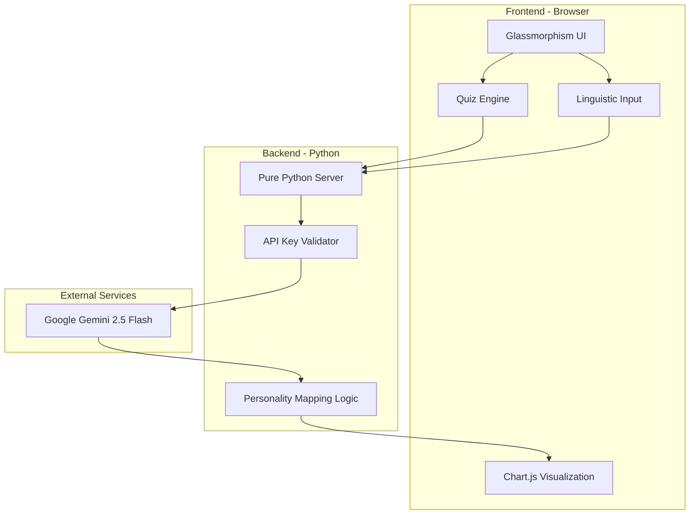

# AI-Powered Personality Analysis System

A professional-grade psychological assessment tool that integrates quantitative data from the **Big Five Inventory (BFI)** with qualitative **Psycholinguistic NLP Analysis** using Google's Gemini AI.

## 🚀 Features
- **Integrated Assessment**: Combines standardized questionnaire metrics with natural language processing.
- **Dynamic Radar Charts**: Visualizes the Five-Factor Model (OCEAN) traits.
- **AI-Generated Insights**: Provides deep psychological profiles, career recommendations, and relationship styles.
- **Privacy-First**: API keys are processed locally and never stored on the server.
- **Responsive Design**: Premium, research-oriented UI with glassmorphism aesthetics.

## 🛠️ Setup & Installation

### 1. Requirements
Ensure you have Python 3.8+ installed. Install the necessary dependencies:
```bash
pip install -r requirements.txt
```

### 2. Configuration
You will need a **Google Gemini API Key**. You can obtain one from the [Google AI Studio](https://aistudio.google.com/).

### 3. Running the System
Start the local research server:
```bash
python server.py
```
Open your browser and navigate to `http://localhost:8000`.

## 🧠 Methodology
The system utilizes:
1. **Big Five Model**: Scoring based on Openness, Conscientiousness, Extraversion, Agreeableness, and Neuroticism.
2. **MBTI Heuristics**: Mapping OCEAN scores to Myers-Briggs Type Indicator frameworks for comparative analysis.
3. **Linguistic Analysis**: Analyzing tone, syntax, and word choice from writing samples to refine the psychological profile.

## 📊 System Architecture & Design

### 1. Component Architecture


### 2. Process Flow (Sequence)

```mermaid
sequenceDiagram
    participant User
    participant Frontend
    participant Server
    participant GeminiAPI

    User->>Frontend: Submit Quiz/Writing Sample
    Frontend->>Server: POST /api/analyze (Data + API Key)
    Server->>Server: Construct AI Prompt
    Server->>GeminiAPI: Generate Content (Prompt)
    GeminiAPI-->>Server: Structured JSON Response
    Server->>Server: Map to MBTI & Character Soulmates
    Server-->>Frontend: Success (JSON Results)
    Frontend->>Frontend: Render Radar Chart & 3D Cards
    Frontend-->>User: Display Personality Insights
```


## 📜 License
&copy; 2026 University Intelligence Research Project. For academic and research purposes only.
